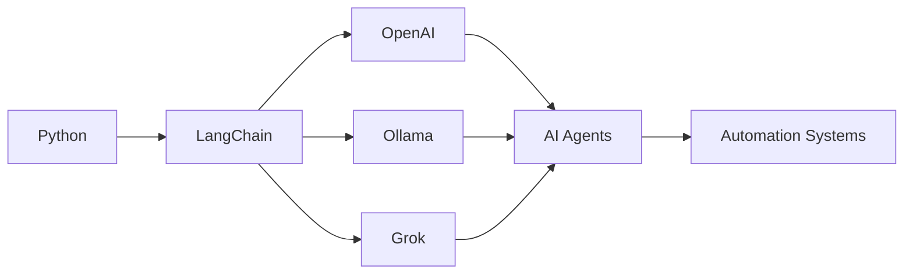

````md
<div align="center">

# 🌌 Enter My Digital Dreamscape


</div>

---

<div align="center">


</div>

# 🧬 About Me

<div align="center">

```python
class DreamEngineer:
    def __init__(self):
        self.name = "Piotr Karmelita"
        self.role = "AI Engineer & Python Developer"
        self.languages = ["Python", "JavaScript", "HTML", "SQL"]
        self.focus = [
            "AI Agents",
            "Machine Learning",
            "Automation",
            "Data Science",
            "LLM Systems"
        ]
        self.current_state = "Building the future 🚀"

    def philosophy(self):
        return "Dream big. Build bigger."

me = DreamEngineer()
print(me.philosophy())
````

</div>

---

# 🎯 Current Mission

<div align="center">

| 🚀 Building            | 🧠 Learning        | 🌌 Exploring         |
| ---------------------- | ------------------ | -------------------- |
| AI Agents              | Advanced ML        | Blockchain           |
| Automation Systems     | Cloud Architecture | Web3                 |
| Data Science Projects  | LLM Engineering    | Predictive Analytics |
| Fullstack Applications | AI Orchestration   | Distributed Systems  |

</div>

---

<div align="center">


</div>

# 💻 Technology Stack

<div align="center">

## 🧠 AI & Machine Learning


---

## 🌐 Backend & APIs


---

## 📊 Data Science


---

## 🗄️ Databases & DevOps


---

## 🎨 Frontend


</div>

---

# 🧠 AI Ecosystem

<div align="center">



</div>

---

<div align="center">


</div>

# 🚀 Featured Projects

## 🤖 RETENX — Agent404 Proactive CSI

```yaml
Tech Stack:
  - Python
  - IBM watsonx
  - Docker
  - React
  - Streamlit

Features:
  - Customer Churn Prediction
  - Procurement Risk Detection
  - Multi-Agent AI
  - Voice-first Operations
  - Workflow Automation
```

🏆 Hackathon Project
🤖 Enterprise AI Agents
🚀 AI-Powered Automation

🔗 https://lablab.ai/ai-hackathons/agentic-ai-hackathon-ibm-watsonx-orchestrate/agent-404/retenx-csi-agent

---

## 🏥 AuraCare Assistant

```yaml
Tech Stack:
  - React
  - TypeScript
  - Gemini API
  - Cloud Run

Features:
  - AI Voice Intake
  - Symptom Analysis
  - Doctor Recommendations
  - Image Analysis
  - Multilingual Support
```

🌐 Healthcare AI
🧠 AI Assistant
🎨 Modern UI/UX

🔗 https://github.com/p-karmelita/AuraCare-Assistant

---

## 🚗 Carsharing Platform

```yaml
Features:
  - Resource Allocation
  - Booking System
  - Authentication
  - Optimization Algorithms
```

🔗 https://github.com/WinerSsss/Carshering

---

## ✈️ Flight Delays Analyzer

```yaml
Features:
  - Interactive Dashboard
  - Statistical Analysis
  - Visualization
  - Aviation Metrics
```

🔗 https://github.com/p-karmelita/Flight-Delays

---

# 🎓 Prestigious Recognition

<div align="center">

## 🇺🇸 International Academic Achievement


<br><br>

```yaml
Recognition:
  Institution: Prestigious American University
  Focus: Innovation & Technology
  Specialization: Artificial Intelligence & Engineering
  Status: Certified Achievement
```

✨ A milestone representing dedication to technology, innovation, and global collaboration.

</div>

---

# 📊 GitHub Analytics

<div align="center">


<br><br>


</div>

---

# 🌠 Vision

<div align="center">

> *"The future belongs to those who build it."*


</div>

---

# 🌐 Connect & Collaborate

<div align="center">

[](https://github.com/p-karmelita)


</div>

---

<div align="center">

# 💭 Developer Philosophy

```python
while coding:
    learn()
    build()
    innovate()
    repeat()

# Dreams into reality 🚀
```


</div>

---

<div align="center">

## ⚡ Fun Fact

> *"I turn coffee ☕ and tea 🍵 into code and dreams into reality!"*


</div>
```
